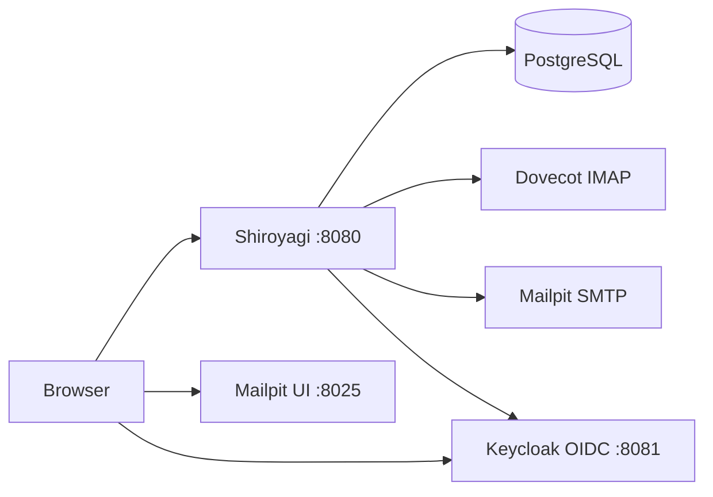

# Shiroyagi

Self-hosted webmail for on-premise mail servers.

## Start development

Create dev secret files first:

```bash
mkdir -p secrets/dev
printf 'shiroyagi' > secrets/dev/postgres_password
openssl rand 32 > secrets/dev/mail_account_kek
printf 'dev-oidc-client-secret' > secrets/dev/oidc_client_secret
```

Then run:

```bash
podman compose -f compose.yaml -f compose.dev.yaml up
```

To run only the Go app locally against the development services:

```bash
OIDC_ISSUER=http://localhost:8081/realms/dev \
OIDC_BROWSER_ISSUER=http://localhost:8081/realms/dev \
OIDC_CLIENT_ID=shiroyagi \
OIDC_CLIENT_SECRET_FILE=secrets/dev/oidc_client_secret \
OIDC_REDIRECT_URI=http://localhost:8080/auth/callback \
DATABASE_HOST=localhost \
DATABASE_PORT=5432 \
DATABASE_NAME=shiroyagi \
DATABASE_USER=shiroyagi \
DATABASE_PASSWORD_FILE=secrets/dev/postgres_password \
MAIL_ACCOUNT_KEK_FILE=secrets/dev/mail_account_kek \
MAIL_ACCOUNT_KEK_VERSION=1 \
go run ./cmd/shiroyagi
```

`MAIL_ACCOUNT_KEK_VERSION` selects the KEK version used for newly saved mail
account secrets. Development uses `1`.

Keycloak imports the development realm automatically on startup. The `dev`
realm, `shiroyagi` OIDC client, and `dev` user are created from
`dev/keycloak/realm.json`.
The development app login is `dev` / `dev`. The Keycloak admin console login
is `admin` / `admin`.

## Development layout



URLs:

- Web: http://localhost:8080
- Keycloak: http://localhost:8081
- Mailpit: http://localhost:8025

Login check:

```text
http://localhost:8080/signin
```

IMAP check:

1. Sign in and open `Mail accounts`.
2. Create a mail account.
3. Open `IMAP` for that account and save the IMAP connection settings.
   Use `dev@example.test` as the email address and IMAP username. Use `dev` as
   the IMAP password.
   When the Go app is run locally against the development services, use
   `localhost`, port `2143`, and protocol `IMAP` for the development Dovecot
   service. When the app runs in compose, use `dovecot`, port `31143`, and
   protocol `IMAP`.
4. Open `Inbox` from the mail account list.

The first IMAP link opens `INBOX` and fetches the latest 100 messages.
Opening a message fetches and displays its inline text body.

## Build

```bash
make build
```

This creates the `shiroyagi` binary and writes Go module, dependency, build
setting, and VCS metadata to `shiroyagi-build-info.txt`.
