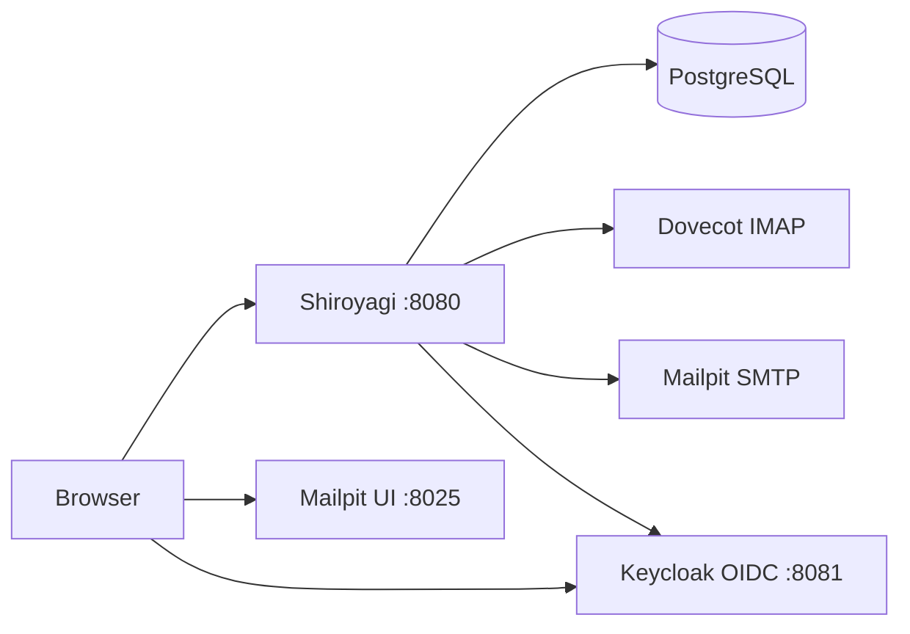

# Shiroyagi

Self-hosted webmail for on-premise mail servers.

## Start development

Create dev secret files first:

```bash
mkdir -p secrets/dev
printf 'shiroyagi' > secrets/dev/postgres_password
openssl rand 32 > secrets/dev/mail_account_kek
printf 'dev-oidc-client-secret' > secrets/dev/oidc_client_secret
```

Then run:

```bash
podman compose -f compose.yaml -f compose.dev.yaml up
```

To run only the Go app locally against the development services:

```bash
OIDC_ISSUER=http://localhost:8081/realms/dev \
OIDC_BROWSER_ISSUER=http://localhost:8081/realms/dev \
OIDC_CLIENT_ID=shiroyagi \
OIDC_CLIENT_SECRET_FILE=secrets/dev/oidc_client_secret \
OIDC_REDIRECT_URI=http://localhost:8080/auth/callback \
go run ./cmd/shiroyagi
```

Keycloak imports the development realm automatically on startup. The `dev`
realm, `shiroyagi` OIDC client, and `dev` user are created from
`dev/keycloak/realm.json`.
The development app login is `dev` / `dev`. The Keycloak admin console login
is `admin` / `admin`.

## Development layout



URLs:

- Web: http://localhost:8080
- Keycloak: http://localhost:8081
- Mailpit: http://localhost:8025

Login check:

```text
http://localhost:8080/signin
```
