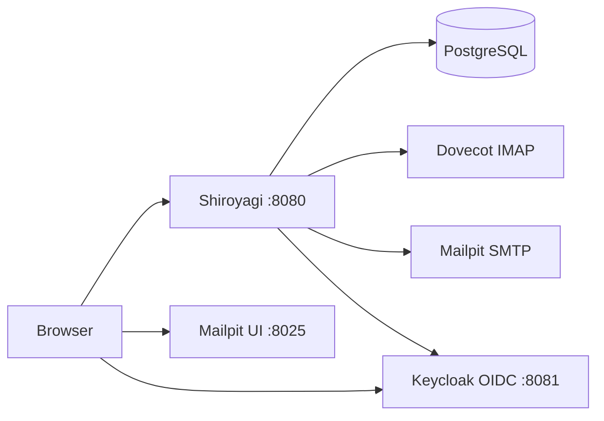

# Shiroyagi

Self-hosted webmail for on-premise mail servers.

## Start development

Create dev secret files first:

```bash
mkdir -p secrets/dev
printf 'shiroyagi' > secrets/dev/postgres_password
openssl rand 32 > secrets/dev/mail_account_kek
printf 'dev-oidc-client-secret' > secrets/dev/oidc_client_secret
```

Windows users can run these commands from WSL.

### Run the complete development environment

Run all development services, including the Go application, in containers:

```bash
podman compose -f compose.yaml -f compose.dev.yaml up
```

### Run the Go application locally

Start the complete development environment in the background:

```bash
podman compose -f compose.yaml -f compose.dev.yaml up -d
```

Stop the containerized Go application:

```bash
podman compose -f compose.yaml -f compose.dev.yaml stop web
```

Then run the Go application on the host.

**macOS and Linux**

```bash
./scripts/run-dev.sh
```

**Windows PowerShell**

```powershell
.\scripts\run-dev.ps1
```

> [!NOTE]
> `MAIL_ACCOUNT_KEK_VERSION` selects the KEK version used to encrypt newly saved mail account secrets. Development uses version `1`.
>
> Keycloak automatically imports the development realm on startup. The `dev` realm, `shiroyagi` OIDC client, and `dev` user are defined in `dev/keycloak/realm.json`.
>
> In compose, Shiroyagi uses `OIDC_ISSUER=http://keycloak.localhost:8081/realms/dev` for discovery, browser redirects, token exchange, and ID token issuer verification. The `keycloak.localhost` name is shared between the browser and the compose network. The app retries OIDC discovery while Keycloak is still starting.
>
> The development app login is `dev` / `dev`. The Keycloak admin console login is `admin` / `admin`.

## Development layout



URLs:

- Web: http://localhost:8080
- Keycloak: http://keycloak.localhost:8081
- Mailpit: http://localhost:8025

Login check:

```text
http://localhost:8080/signin
```

IMAP check:

1. Sign in and open `Mail accounts`.
2. Create a mail account.
3. Open `IMAP` for that account and save the IMAP connection settings.
   Use `dev@example.test` as the email address and IMAP username. Use `dev` as
   the IMAP password.
   When the Go app is run locally against the development services, use
   `localhost`, port `2143`, and protocol `IMAP` for the development Dovecot
   service. When the app runs in compose, use `dovecot`, port `31143`, and
   protocol `IMAP`. The compose development environment sets
   `IMAP_ALLOW_INSECURE_AUTH=true` so Dovecot can accept LOGIN over the
   non-TLS `IMAP` connection.
4. Open `Inbox` from the mail account list.

The first IMAP link opens `INBOX` and fetches the latest 100 messages.
Opening a message fetches and displays its inline text body.

SMTP check:

1. Sign in and open `Mail accounts`.
2. Create or reuse a mail account.
3. Open `SMTP` for that account and save the SMTP connection settings.
   Use protocol `Plain`, SMTP username `dev@example.test`, and SMTP password
   `dev`.
   When the Go app is run locally against the development services, use
   `localhost` and port `1025`. When the app runs in compose, use `mailpit`
   and port `1025`. The compose development environment sets
   `SMTP_ALLOW_INSECURE_AUTH=true` so Mailpit can accept SMTP AUTH over the
   non-TLS `Plain` connection.
4. Open `Send test` from the mail account list.
5. Enter a recipient, subject, and body, then send the message.
6. Open Mailpit at http://localhost:8025 and confirm the message.

Reply check:

1. Configure both IMAP and SMTP for the same mail account.
2. Open `Inbox` from the mail account list.
3. Open a fixture message and click `Reply`.
4. Confirm that `To` is prefilled from `Reply-To` or `From`, and that the
   subject is prefixed with `Re:`.
5. Send the reply.
6. Open Mailpit at http://localhost:8025 and confirm that the message has
   `In-Reply-To` and `References` headers for the original message.
7. Confirm that the original message has the IMAP `\Answered` flag:

   ```bash
   podman compose -f compose.yaml -f compose.dev.yaml exec dovecot \
     doveadm fetch -u dev@example.test 'uid flags hdr.message-id' mailbox INBOX all
   ```

   The replied message should include `\Answered` in its `flags` output.
   The Shiroyagi inbox list should also show `Replied` in the message status
   column.

Reply all check:

1. Open the `Reply all fixture` message in `Inbox` and click `Reply all`.
2. On the message detail page, confirm that the original `To` and `Cc`
   headers are visible.
3. Confirm that the reply form `To` is `alice@example.test`.
4. Confirm that the reply form `Cc` is `bob@example.test, carol@example.test`.
5. Send the reply and confirm it in Mailpit.

If an existing Dovecot development volume was created before the fixture was
added, recreate or reseed the volume so the new fixture message is copied.

After a reply is sent, Shiroyagi attempts to add the IMAP `\Answered` flag to
the original message. If the SMTP send succeeds but flag update fails, the
reply remains sent and the result page shows a warning.

Forward check:

1. Configure both IMAP and SMTP for the same mail account.
2. Open the `Forward fixture` message in `Inbox` and click `Forward`.
3. Confirm that the subject is prefixed with `Fwd:` and the body includes the
   forwarded message header and original text body.
4. Enter a recipient and send the forward.
5. Open Mailpit at http://localhost:8025 and confirm the forwarded message.
6. Confirm that the original message has the IMAP `$Forwarded` flag:

   ```bash
   podman compose -f compose.yaml -f compose.dev.yaml exec dovecot \
     doveadm fetch -u dev@example.test 'uid flags hdr.message-id hdr.subject' mailbox INBOX all
   ```

   The original fixture message should include `$Forwarded` in its `flags`
   output. The Shiroyagi inbox list should also show `Forwarded` in the
   message status column. `$Forwarded` is an IMAP keyword and depends on server
   support; if the SMTP send succeeds but the flag update fails, the forward
   remains sent and the result page shows a warning.

Attachments are handled separately in #12. Forwarding currently includes the
inline text body only.

## Build

```bash
make build
```

This creates the `shiroyagi` binary and writes Go module, dependency, build setting, and VCS metadata to `shiroyagi-build-info.txt`.

The binary version defaults to `git describe --tags --always --dirty`.

```bash
./shiroyagi --version
```

## Release build

To create a release archive for the current operating system and architecture:

```bash
make release
```

To build an archive for a specific target platform, set `GOOS` and `GOARCH`:

```bash
make release GOOS=linux GOARCH=amd64
```

Generated archives and their SHA-256 checksums are written to `dist/`:

```text
dist/
├── shiroyagi_v0.1.0_linux_amd64.tar.gz
└── checksums.txt
```

Release binaries are built with `CGO_ENABLED=0` to avoid runtime dependencies on the target system’s C library, such as `glibc`.
